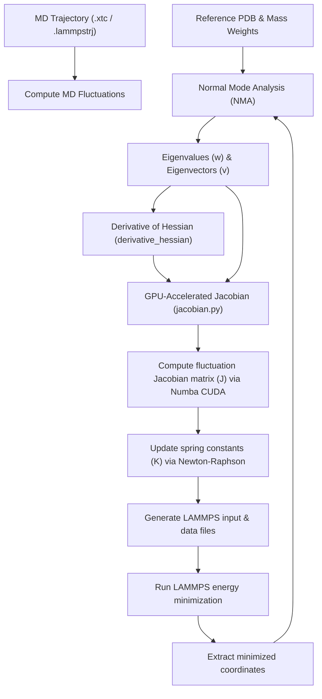

# ⚡ Heterogeneous Elastic Network Model (hENM) with CUDA Acceleration

This repository implements the **Heterogeneous Elastic Network Model (hENM)** for coarse-grained biomolecular simulations. The main objective of the hENM framework is to compute heterogeneous spring constants (force constants, $K$) for the network bonds by fitting Normal Mode Analysis (NMA) fluctuations to Molecular Dynamics (MD) trajectory fluctuations.

To solve the computationally intensive parameter optimization loop, this codebase leverages **Numba CUDA** to offload heavy matrix derivative calculations to the GPU. This results in orders-of-magnitude acceleration compared to CPU-based parallel solvers.

---

## 🚀 Why GPU Acceleration (Numba CUDA)?

Refining thousands of heterogeneous spring constants requires solving a Newton-Raphson parameter update step, which depends heavily on the **Jacobian matrix ($J$)** representing the derivative of the NMA fluctuations with respect to each spring constant $K_n$:

$$J_{m, n} = \frac{\partial \langle (\Delta R_m)^2 \rangle_{\text{NMA}}}{\partial K_n}$$

Calculating this Jacobian analytical derivative is the primary computational bottleneck:
1. **Eigenvector Derivatives (Fox-Kapoor Formula)**: To compute the derivative of the eigenvector $v_k$ with respect to the spring constant $K_n$, we must evaluate a summation over all other modes $r \neq k$ ($3N-6$ modes).
2. **Double Nested Loop Complexity**: For a network with $M$ bonds, computing the full $M \times M$ Jacobian requires evaluating this derivative for every mode and every combination of bonds. On a CPU, this is an $O(M^2 \cdot N)$ or $O(M \cdot N^3)$ operation which can take hours or days even for moderate-sized systems.

### The CUDA Solution
By using **Numba CUDA**, we parallelize this calculation over a 2D grid of GPU threads:
- **Thread Mapping**: Every thread in a 2D block computes a single element $J_{m, n}$ of the Jacobian. For $M$ bonds, we spawn $M \times M$ threads in parallel.
- **Device Compilation**: Core routines like computing eigenvalues and eigenvector projections are compiled to native GPU machine code using `@cuda.jit`.
- **Zero-Copy Memory Overhead**: All inputs (eigenvalues, eigenvectors, bond lists, Hessian derivatives) are loaded onto the GPU memory once using `cuda.to_device(...)` before launching the kernel, reducing GPU-CPU communication overhead.

---

## 📊 Workflow Architecture

The flowchart below shows how the NMA solver, the Numba CUDA Jacobian calculator, and the LAMMPS energy minimization step run in a closed loop during refinement:



---

## 🧮 Mathematics of GPU Derivatives

### 1. Eigenvalue Derivatives
The derivative of the eigenvalue $\lambda_k$ with respect to the spring constant $K_n$ of the bond connecting atoms $i$ and $j$ is computed as:
$$\frac{\partial \lambda_k}{\partial K_n} = \vec{v}_k^T \frac{\partial H}{\partial K_n} \vec{v}_k$$
where $H$ is the mass-weighted Hessian matrix and $\frac{\partial H}{\partial K_n}$ is the derivative of the Hessian with respect to the $n$-th spring constant (computed analytically as a $6 \times 6$ non-zero submatrix).

### 2. Eigenvector Derivatives (Fox-Kapoor Equation)
The analytical derivative of the mass-weighted eigenvector $\vec{v}_k$ is:
$$\frac{\partial \vec{v}_k}{\partial K_n} = \sum_{r \neq k}^{3N-6} \frac{\vec{v}_r^T \left( \frac{\partial H}{\partial K_n} - \frac{\partial \lambda_k}{\partial K_n} I \right) \vec{v}_k}{\lambda_k - \lambda_r} \vec{v}_r$$
This summation is offloaded directly to the GPU in the Numba device function [gpu_deri_eign_vec_partial](file:///c:/Users/sriva/OneDrive/Desktop/henm/hENM_CUDA_numba/jacobian.py#L53-L108). It gathers only the 6 required components of the derivative eigenvector for the interacting atom pair, avoiding full $3N$-dimensional vector allocations in GPU registers.

---

## 📂 GPU & Core Files Overview

Here is a list of the primary files that enable GPU acceleration:

- **[jacobian.py](file:///c:/Users/sriva/OneDrive/Desktop/henm/hENM_CUDA_numba/jacobian.py)**
  Contains the main GPU-accelerated Jacobian interface:
  - [jacobian_kernel_core](file:///c:/Users/sriva/OneDrive/Desktop/henm/hENM_CUDA_numba/jacobian.py#L115-L196): The 2D CUDA kernel that parallelizes the calculation of the full $M \times M$ Jacobian matrix.
  - [get_jacobian](file:///c:/Users/sriva/OneDrive/Desktop/henm/hENM_CUDA_numba/jacobian.py#L197-L257): Host launcher that transfers inputs to the device, executes the kernel, and copies the resulting Jacobian back to the host CPU.
  - [gpu_deri_eign_val](file:///c:/Users/sriva/OneDrive/Desktop/henm/hENM_CUDA_numba/jacobian.py#L20-L49): Device function to compute eigenvalue derivatives.
  - [gpu_deri_eign_vec_partial](file:///c:/Users/sriva/OneDrive/Desktop/henm/hENM_CUDA_numba/jacobian.py#L53-L108): Device function computing the partial Fox-Kapoor eigenvector derivatives.

- **[gpu_eigen_value_derivative.py](file:///c:/Users/sriva/OneDrive/Desktop/henm/hENM_CUDA_numba/gpu_eigen_value_derivative.py)**
  A standalone module containing [eigenvalue_jacob_gpu](file:///c:/Users/sriva/OneDrive/Desktop/henm/hENM_CUDA_numba/gpu_eigen_value_derivative.py#L48-L80) to compute the derivatives of all eigenvalues with respect to all bond spring constants on the GPU.

- **[gpu_eigen_vector_derivative.py](file:///c:/Users/sriva/OneDrive/Desktop/henm/hENM_CUDA_numba/gpu_eigen_vector_derivative.py)**
  A standalone module containing [eigenvector_jacobian_gpu](file:///c:/Users/sriva/OneDrive/Desktop/henm/hENM_CUDA_numba/gpu_eigen_vector_derivative.py#L105-L134) to compute the derivatives of a specific eigenvector (mode $k$) with respect to all bond spring constants.

- **[derivative_hessian_updated.py](file:///c:/Users/sriva/OneDrive/Desktop/henm/hENM_CUDA_numba/derivative_hessian_updated.py)**
  Implements [derivative_hessian](file:///c:/Users/sriva/OneDrive/Desktop/henm/hENM_CUDA_numba/derivative_hessian_updated.py#L5-L16), which computes the analytical $6 \times 6$ Hessian derivative submatrix $\frac{\partial H}{\partial K_n}$ for a given bond.

- **[force_constant_jacobian.py](file:///c:/Users/sriva/OneDrive/Desktop/henm/hENM_CUDA_numba/force_constant_jacobian.py)**
  Orchestrates the Newton-Raphson parameter refinement algorithm using the Jacobian computed from [jacobian.py](file:///c:/Users/sriva/OneDrive/Desktop/henm/hENM_CUDA_numba/jacobian.py).

- **[code_HENM.py](file:///c:/Users/sriva/OneDrive/Desktop/henm/hENM_CUDA_numba/code_HENM.py)**
  The main entry point for the hENM workflow. It loads parameters, initial guesses, computes MD fluctuations, and calls either CPU iterative algorithms or the GPU-accelerated Jacobian methods depending on configuration.

---

## 🛠️ Requirements & Setup

### Prerequisites
To use GPU acceleration, your system must have:
1. **NVIDIA GPU** with CUDA support.
2. **CUDA Toolkit** installed (matching your GPU drivers).
3. A Python environment containing:
   - `numpy`
   - `numba` (with CUDA support enabled)
   - `scipy`
   - `mdtraj` (for reading PDB/XTC/LAMMPSTRJ trajectories)
   - `matplotlib` (for generating convergence plots)
   - `joblib`
   - `lammps` (Python wrapper to run energy minimizations)

> [!TIP]
> You can verify if Numba can successfully detect your NVIDIA GPU and CUDA driver by running:
> ```bash
> python -c "from numba import cuda; print(cuda.detect())"
> ```

---

## ⚙️ Configuration & Execution

### 1. Preparing the INPUT Directory
All configuration files and simulation inputs must be placed in the `INPUT/` directory:
- `REFERENCE.pdb`: Energy-minimized or average coarse-grained structure.
- `COARSE_GRAINED_MAPPED_TRAJECTORY.xtc` (or `.lammpstrj`): Coarse-grained mapped trajectory.
- `mass_weights.txt`: Masses of coarse-grained sites.
- `bondlist.csv`: Map of bonds to be parameterized, indicating starting spring constants.
- `energy_min.in`: LAMMPS input script to execute energy minimization.
- `parameter.txt`: Simulation parameters.

### 2. Configuring parameters in `parameter.txt`
To run the GPU-accelerated Jacobian optimization, edit `INPUT/parameter.txt` and ensure `method` is set to `jacobian`:
```text
tolerance 0.001
ALPHA 0.0001
beta 0.0001
max_itr 20
T 310
lammps_damp 1 
lammps_dump_value 1000                     
lammps_run_value 100000000                
lammps_box_size 700                       
bondlist_name 'bondlist.csv'
flag_identical_bonds 'no'
flag_automate_ALPHA_beta_values 'yes'
iterative_method 'NR_method'
stride 1000
count_run_value 3
initial_guess 'boltzmann_inversion'
system 'mspa'
method 'jacobian'  <--- Set to 'jacobian' to run the GPU-accelerated code
```

### 3. Running the Simulation
Execute the main entry script by passing the path to the working directory and the trajectory format as arguments:
```bash
python code_HENM.py "." "xtc"
```

### 4. Restarting an Interrupted Job
If a parameter optimization run gets interrupted, you can restart it using:
```bash
python restart_code_HENM.py "." run "xtc"
```

### 5. Running on a HPC Cluster
For running jobs on a Slurm cluster, a template job script is provided in **[test_cluster.slurm](file:///c:/Users/sriva/OneDrive/Desktop/henm/hENM_CUDA_numba/test_cluster.slurm)**.
